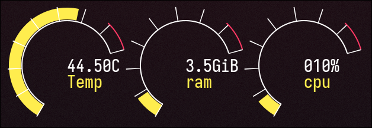

# Desktop Gauges

Gauge-like widgets for the desktop.

# Overview

Desktop gauges is a small widget/software (I'm not sure how to catalog this honestly)
for displaying different system metrics on your system.

# Why

I built this because I was trying to use conky for creating a dashboard like desktop
display for system metrics, but found out that conky does not expose a cairo context
in wayland.

> [!NOTE]
> This is still in early development

# Planned stuff

- [ ] Configuration system
    -   Being able to dynamically load and setup a dashboard via a configuration file
- [ ] Refactor the widget system so adding more gauge types is easier.

That's pretty much it.
